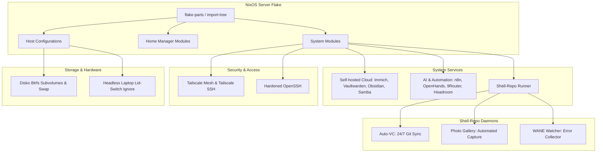

# ❄️ NixOS Server - Reusable Homelab

[](https://nixos.org)
[](https://github.com/hercules-ci/flake-parts)
[](LICENSE)
[](docs/operations.md)

A clean, declarative, and robust multi-host NixOS server configuration built with **[flake-parts](https://github.com/hercules-ci/flake-parts)** and **[import-tree](https://github.com/denful/import-tree)**. Optimized for 24/7 homelab operation, AI workloads, automated git synchronization, and headless laptop deployments.

---

## 🏛️ Architecture Overview



---

## ✨ Key Features

- 🏠 **Headless Homelab:** Clean, strictly headless server environment with zero desktop or graphical overhead.
- 💻 **Laptop Server Ready:** Automated lid-switch ignore (`HandleLidSwitch = "ignore"`) and sleep/suspend suppression for 24/7 laptop servers.
- 💾 **Declarative Disko Partitioning:** Reproducible GPT partitioning with ESP (`/boot`), swap, and Btrfs subvolumes (`@`, `@home`, `@nix`, `@persist`, `@log`).
- 🛡️ **OOM & Low-RAM Protection:** Installer immediately enables swap, routes `TMPDIR=/mnt/tmp` to disk, and throttles parallel jobs to prevent out-of-memory crashes on $\le 4\text{GB}$ devices or non-NVMe media.
- 🤖 **AI & Automation Suite:** **n8n**, **9Router**, and **Headroom**; **OpenHands** is disabled until an isolated execution host is available.
- 📸 **Media & Cloud Stack:** **Immich**, **Glance**, **Vaultwarden**, **Obsidian LiveSync** (CouchDB), and authenticated **Samba NAS**.
- 💾 **Encrypted Backups:** Daily Restic backups from consistent Btrfs snapshots. The configured local destination requires independent storage to protect against disk failure.
- 🔄 **Auto-VC 24/7:** Automated continuous staging, conventional committing, and rebase pushing using dedicated GitHub deploy keys.
- 👁️ **WANE Watcher & CLI:** Real-time warning and error journal watcher with an instant terminal inspector (`wane --show`, `wane --clear`, `wane --status`, `wane --follow`).
- 🐚 **Shell-Repo Runner:** Systemd service runner for custom background daemons (**Photo Gallery** camera capture, **Auto-VC** 24/7 git sync, **WANE Watcher** error collector) with isolated runtime packages.
- 🌐 **Zero-Trust Tailscale:** Automatic peer-to-peer mesh networking and passwordless Tailscale SSH.

---

## 📊 Services & Port Matrix

| Service | Port | Category | Type | Default URL |
| :--- | :--- | :--- | :--- | :--- |
| **Glance Dashboard** | `443` | Overview & Metrics | Native | `https://<fqdn>/` |
| **Immich** | `8443` | Photos & Video | Native | `https://<fqdn>:8443/` |
| **n8n** | `8445` | Workflow Automation | Native | `https://<fqdn>:8445/` |
| **Vaultwarden** | `8444` | Password Manager | Native | `https://<fqdn>:8444/` |
| **Obsidian LiveSync**| `8446` | Note Synchronization | Native | `https://<fqdn>:8446/` |
| **Samba NAS** | `139, 445` | Local Storage | Native | `smb://<server-ip>/nas` (account required) |
| **OpenHands** | — | AI Software Engineer | Docker | Disabled |
| **9Router** | `8447` | LLM Gateway & Router | Docker | `https://<fqdn>:8447/` |
| **Headroom** | `8448` | Context Compression | Docker | `https://<fqdn>:8448/` |

Use the full Tailscale hostname shown by `tailscale serve status` for `<fqdn>`.
Web backends are loopback-only. See the [Services Guide](docs/services.md) and
[upgrade instructions](docs/operations.md) before applying these access changes.

---

## 📚 Documentation Index

| Guide | Description |
| :--- | :--- |
| [Operations and migration](docs/operations.md) | HTTPS access changes, NAS accounts, backups, restores and resource settings |
| [💾 Installation & Deployment](docs/installation.md) | Complete step-by-step guide for bare-metal, low-RAM, non-NVMe, and remote installations |
| [🛠️ Services Architecture & Matrix](docs/services.md) | Full breakdown of all homelab services, ports, data persistence, and secrets |
| [🔄 Auto-VC 24/7 Guide](docs/auto-vc-guide.md) | Automated Git add, commit, and push daemon setup and CLI commands |
| [👁️ WANE Watcher & CLI Guide](docs/wane-guide.md) | System warning & error journal monitor, log rotation, and `wane` commands |
| [🐚 Shell-Repo & Private Repo Guide](docs/shell-repo.md) | Shell service runner overview and instructions for forking `shell-repo` into a private repo |
| [📦 Adding New Services](docs/adding-services.md) | Developer guide for adding native NixOS services or declarative OCI containers |

---

## 🚀 Quick Commands

```bash
# 1. Bare-metal Wipe & Install (from Live USB)
sudo ./install.sh --disk /dev/nvme0n1 --host <host>

# 2. Remote Deployment over SSH (nixos-anywhere)
./install.sh --mode remote --host <host> --target root@<server-ip> --disk /dev/sda

# 3. Post-Installation Setup (GitHub 24/7 Deploy Key & Tailscale)
./post-install.sh

# 4. Inspect System Warnings & Errors
wane --show 20 desc all
wane --status

# 5. Rebuild System after Config Changes
nh os switch path:.

# 6. Check & Lint Nix Flake
nix flake check --impure
nix run nixpkgs#alejandra -- .
nix run nixpkgs#statix -- check .
nix run nixpkgs#deadnix -- .
```

---

## 🔒 Local Inventory

The tracked repository contains no deployment identity. Before building the
`homelab` host, copy `hosts/homelab/_local.example.nix` to
`hosts/homelab/_local.nix` and set the hostname, primary user/UID, public SSH keys,
Git identity, Tailscale identities, location and machine-specific paths. The
local inventory is ignored by Git. Use a `path:` flake reference so Nix includes
that ignored file.

To configure a repository-specific deploy key after installation, run:
```bash
./post-install.sh
```
This generates a dedicated GitHub deploy key (`~/.ssh/id_github_deploy`) with scoped write permissions.

---

## 📄 License

This project is licensed under the [MIT License](LICENSE).
