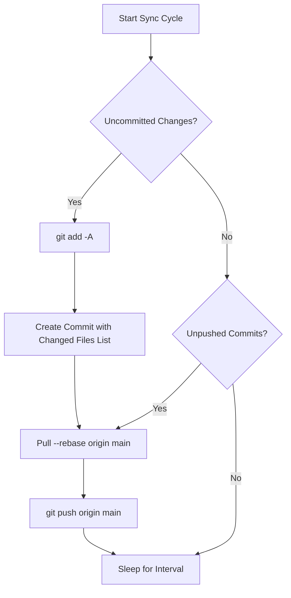

# 🔄 Auto-VC: Automated Git Version Control Daemon

**Auto-VC** is a zero-dependency background daemon designed to continuously monitor your NixOS configuration repository, automatically staging changes, generating conventional commits, and pushing to GitHub 24/7 using a dedicated deploy key.

---

## 🎯 Purpose & Why It Exists

On a self-hosted homelab server, configuration files change frequently (e.g., tweaking Nix modules, adjusting environment settings, updating services). 

Manually running `git add`, `git commit`, and `git push` every time is tedious and easy to forget. **Auto-VC** turns your repository into a self-backing, version-controlled repository:
- **Unattended 24/7 Sync:** Commits and pushes changes automatically without human intervention.
- **No Token Expiration:** Uses an SSH Deploy Key (`~/.ssh/id_github_deploy`) that never expires, unlike GitHub Personal Access Tokens (PATs).
- **Merge-Safe:** Pulls remote changes with rebase before pushing to prevent non-fast-forward push rejections.
- **Crash Resilient:** Traps system signals (`SIGINT`/`SIGTERM`) and cleans up stale `.git/index.lock` files to prevent lockouts.

---

## ⚙️ How It Works (The Sync Cycle)

Every cycle (configurable, default: 60 seconds), Auto-VC executes:



1. **Change Detection:** Queries `git status --porcelain`.
2. **Staging:** Stages all modified, added, and deleted files (`git add -A`).
3. **Structured Commit:** Generates a commit message detailing the timestamp and changed files:
   ```text
   chore(auto-vc): automated backup 2026-09-08 04:30:00

   Automated sync performed by Auto-VC on homelab.
   Modified files:
    M hosts/homelab/default.nix
    A shell-repo/auto-vc/auto-vc.sh
   ```
4. **Rebase Pull:** Runs `git pull --rebase origin main` so remote edits merge cleanly before pushing.
5. **Authenticated Push:** Pushes to `origin main` using your dedicated SSH deploy key.

---

## 🛠️ CLI Usage & Commands

The script is located at [`shell-repo/auto-vc/auto-vc.sh`](../shell-repo/auto-vc/auto-vc.sh). You can invoke it manually anytime:

### Inspect Status (`--status`)
Shows current branch, remote, uncommitted files, and unpushed commits:
```bash
./shell-repo/auto-vc/auto-vc.sh --status
```

### Dry Run (`--dry-run`)
Checks for changes and shows what would be committed without altering Git state:
```bash
./shell-repo/auto-vc/auto-vc.sh --dry-run
```

### Single Sync (`--run-once`)
Runs one check-and-sync cycle and exits immediately:
```bash
./shell-repo/auto-vc/auto-vc.sh --run-once
```

### 24/7 Daemon (`--daemon`)
Starts the continuous monitoring loop:
```bash
./shell-repo/auto-vc/auto-vc.sh --daemon --interval 60
```

---

## 🔧 NixOS Declarative Configuration

Auto-VC is managed through the `homelab.shellRepo.autoVc` module in [`modules/system/services/shell-repo.nix`](../modules/system/services/shell-repo.nix):

```nix
homelab.shellRepo = {
  enable = true;
  autoVc = {
    enable = true;
    repoPath = "/home/kryisnn/.config/flint"; # Target repository to monitor
    branch = "main";                         # Target Git branch
    remote = "origin";                       # Git remote
    intervalSeconds = 60;                    # Frequency of checks (seconds)
    user = "kryisnn";                        # User to run systemd service as
    sshKeyPath = "/home/kryisnn/.ssh/id_github_deploy"; # SSH private key
    commitPrefix = "chore(auto-vc)";         # Commit message prefix
    pullBeforePush = true;                   # Pull rebase before push
  };
};
```

This creates a self-healing systemd service:
```bash
# Check service status
systemctl status auto-vc.service

# View live daemon logs
journalctl -u auto-vc.service -f
```

---

## 🔑 GitHub Authentication Setup

For 24/7 pushing to succeed, ensure your deploy key has **write access**:
1. Run `./post-install.sh` or generate your key:
   ```bash
   ssh-keygen -t ed25519 -C "homelab-deploy-24/7" -f ~/.ssh/id_github_deploy -N ""
   ```
2. In GitHub: **Repository Settings** -> **Deploy Keys** -> **Add deploy key**:
   - Paste the public key (`~/.ssh/id_github_deploy.pub`).
   - Title: `Homelab 24/7 Deploy Key`.
   - **Check: `[x] Allow write access`**.
3. Set your git remote to SSH:
   ```bash
   git remote set-url origin git@github.com:davindakhrisna/server-nixos.git
   ```
